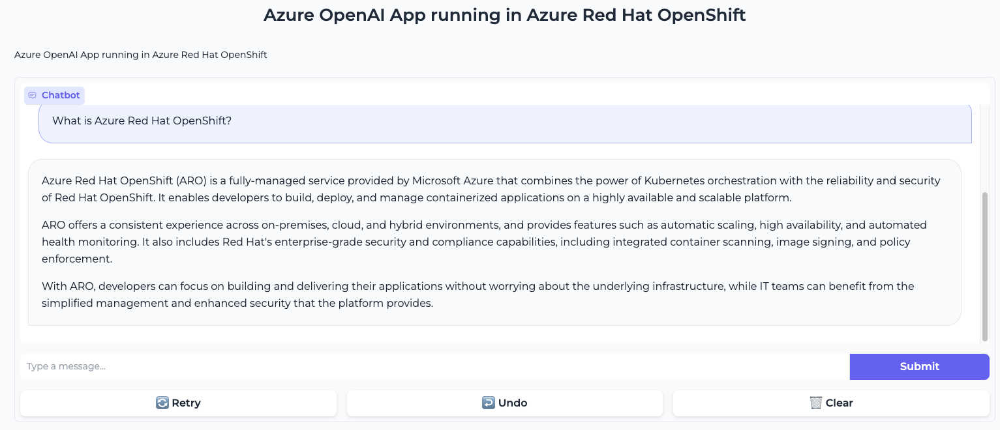

# Azure OpenAI ARO Application

A containerized application that deploys a Gradio frontend with Azure OpenAI as a backend LLM within Azure Red Hat OpenShift (ARO) clusters.



## Overview

This application provides a web-based chat interface powered by Azure OpenAI's GPT models, packaged as a containerized application for easy deployment on OpenShift.

Key features:
- Gradio-based interactive chat interface
- Azure OpenAI GPT integration (supports GPT-3.5 Turbo and GPT-4)
- Containerized for easy deployment
- Kubernetes and OpenShift deployment manifests
- Support for both vanilla Kubernetes and OpenShift

## Architecture

- **Frontend**: Gradio web interface running in container
- **Backend**: Azure OpenAI GPT models
- **Deployment**: Azure Red Hat OpenShift (ARO)


## Prerequisites

- Access to an OpenShift cluster (or Kubernetes cluster)
- OpenShift CLI (`oc`) installed
- Azure OpenAI service setup with API access
- Container registry access (e.g., Quay.io)

## Quickstart Guide

### 1. Log in to OpenShift

Before starting any deployment, you need to authenticate with your OpenShift cluster:

```bash
# Login with username/password
oc login --server=https://api.your-openshift-cluster:6443 -u username -p password

# OR use token authentication
oc login --server=https://api.your-openshift-cluster:6443 --token=sha256~your-token

# Verify login success
oc whoami
oc project
```

### 2. Clone the Repository

```bash
git clone https://github.com/yourusername/aro-azureopenai.git
cd aro-azureopenai
```

### 2. Build and Push the Container

Option 1: Using the Makefile:

The project includes a powerful Makefile that streamlines the container build and deployment process:

```makefile
# Makefile structure:
NAME=aro-azureopenai
VERSION=v3
REGISTRY="quay.io/rcarrata"
TOOL="podman"

build:
	@${TOOL} build -t localhost/${NAME}:${VERSION} .

tag:
	@${TOOL} tag localhost/${NAME}:${VERSION} ${REGISTRY}/${NAME}:${VERSION}

push:
	@${TOOL} push ${REGISTRY}/${NAME}:${VERSION}

run:
	@${TOOL} run -d -p 8080:8080 ${REGISTRY}/${NAME}:${VERSION}
```

#### Makefile Variables

- `NAME`: Container image name (default: aro-azureopenai)
- `VERSION`: Container image version tag (default: v3)
- `REGISTRY`: Container registry URL (default: quay.io/rcarrata)
- `TOOL`: Container tool to use (default: podman, can be changed to docker)

#### Makefile Targets

- `build`: Builds the container image locally
- `tag`: Tags the local image for the remote registry
- `push`: Pushes the tagged image to the remote registry
- `run`: Runs the container locally for testing (port 8080)
- `all`: Default target that runs build, tag, and push sequentially

#### Usage

```bash
# Edit the Makefile to set your registry information
# Change NAME, VERSION, REGISTRY, and TOOL as needed

# Build, tag and push all at once
make

# Or execute individual commands
make build
make tag
make push

# Test locally
make run
```

Option 2: Using OpenShift build:
```bash
oc new-build --binary --name=aro-azureopenai -l app=aro-azureopenai
oc start-build aro-azureopenai --from-dir=. --follow
```

### 3. Deploy to OpenShift with Custom Namespace

You can deploy the application to a namespace of your choice:

```bash
# Set your desired namespace name
export NAMESPACE="my-custom-namespace"

# Create the namespace
oc create namespace $NAMESPACE

# Update the namespace in the Kustomize files
sed -i "s/aro-azureopenai/$NAMESPACE/g" manifests/base/namespace.yaml
sed -i "s/namespace: aro-azureopenai/namespace: $NAMESPACE/g" manifests/overlays/ocp/kustomization.yaml
sed -i "s/namespace: aro-azureopenai/namespace: $NAMESPACE/g" manifests/overlays/ocp/route.yaml

# Deploy to your custom namespace
oc apply -k manifests/overlays/ocp -n $NAMESPACE
```

For Kubernetes:
```bash
# Set your desired namespace name
export NAMESPACE="my-custom-namespace"

# Create the namespace
kubectl create namespace $NAMESPACE

# Update the namespace in the Kustomize files
sed -i "s/aro-azureopenai/$NAMESPACE/g" manifests/base/namespace.yaml
sed -i "s/namespace: aro-azureopenai/namespace: $NAMESPACE/g" manifests/overlays/k8s/kustomization.yaml

# Deploy to your custom namespace
kubectl apply -k manifests/overlays/k8s -n $NAMESPACE
```

### 4. Configure Azure OpenAI Credentials

```bash
# Set your Azure OpenAI credentials
export OPENAI_API_BASE="https://your-azure-openai-endpoint.openai.azure.com/"
export OPENAI_API_KEY="your-api-key"
export NAMESPACE="aro-azureopenai"

# Create the secret
cat <<EOF | oc apply -n $NAMESPACE -f -
apiVersion: v1
kind: Secret
metadata:
  name: azure-openai
type: Opaque
data:
  OPENAI_API_BASE: $(echo -n "$OPENAI_API_BASE" | base64)
  OPENAI_API_KEY: $(echo -n "$OPENAI_API_KEY" | base64)
EOF
```

### 5. Access the Application

Get the application route:
```bash
oc get route aro-azureopenai -n aro-azureopenai
```

## Configuration Options

The application can be configured through the ConfigMap in `manifests/base/configmap.yaml`:

```yaml
apiVersion: v1
kind: ConfigMap
metadata:
  name: azureopenai-config
data:
  title: "Azure OpenAI App running in Azure Red Hat OpenShift"
  description: "Microsoft GBB team and Red Hat source code team"
  port: "8080"
  deployment_name: "gpt-35-turbo"
  api_type: "azure"
  api_version: "2023-05-15"
```

## Common Operations

### Check Deployment Status
```bash
oc get pods -n aro-azureopenai
```

### View Application Logs
```bash
oc logs -f deployment/aro-azureopenai -n aro-azureopenai
```

### Scale the Deployment
```bash
oc scale deployment/aro-azureopenai --replicas=3 -n aro-azureopenai
```

### Test the Application Programmatically
```bash
python test_app.py --url <application-route-url> --prompt "Hello, how are you today?"
```

## Development

### Local Development

```bash
# Set environment variables
export OPENAI_API_BASE="your-azure-openai-endpoint"
export OPENAI_API_KEY="your-api-key"

# Install dependencies
pip install -r requirements.txt

# Run the application
python main.py
```

### Modifying the Container

1. Update the necessary files
2. Build and push a new container version
3. Update the deployment configuration if needed
4. Redeploy the application

## License

This project is licensed under the GNU Affero General Public License v3 (AGPL-3.0).

## Acknowledgements

- Microsoft GBB TEAM
- Red Hat Source Code Team

## Contributing

Pull requests are welcome. For major changes, please open an issue first to discuss what you would like to change.